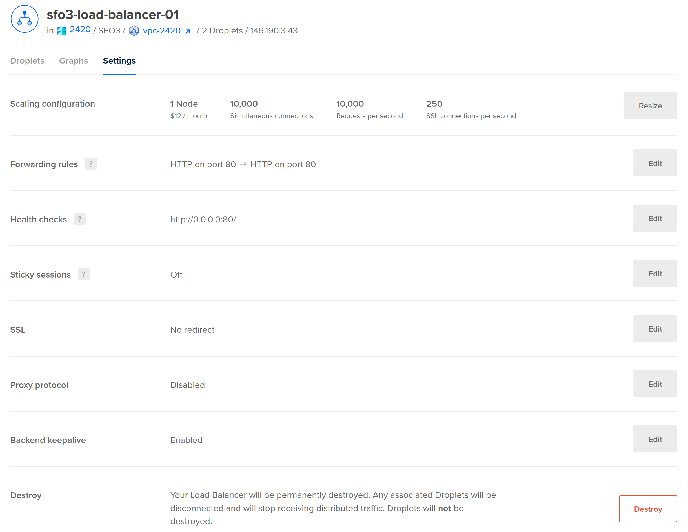
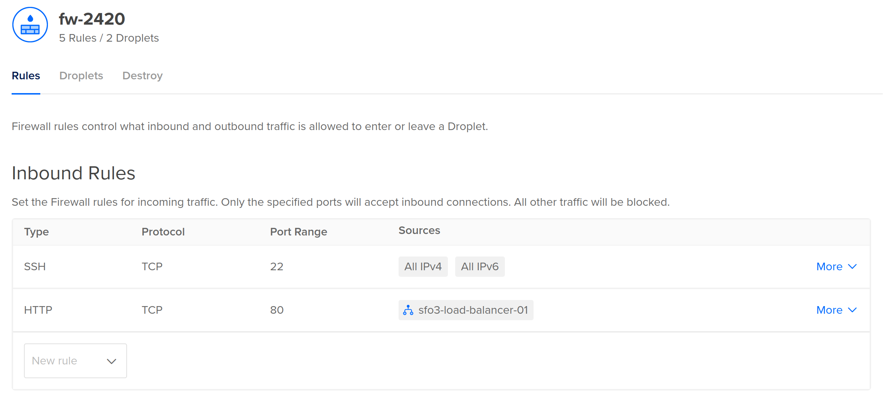
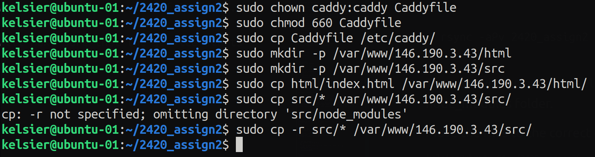
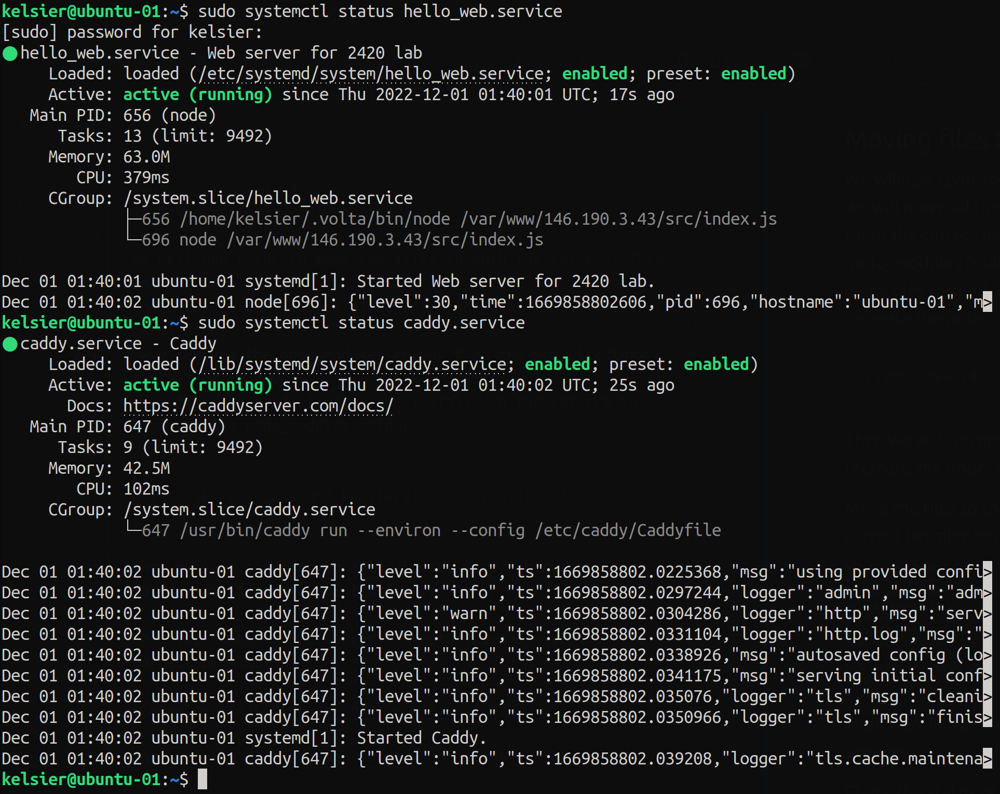
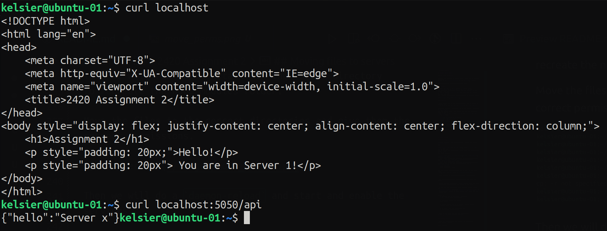
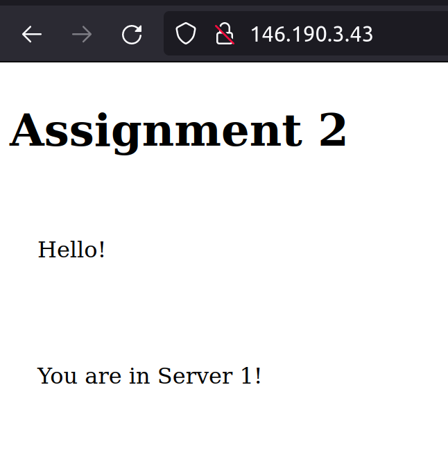
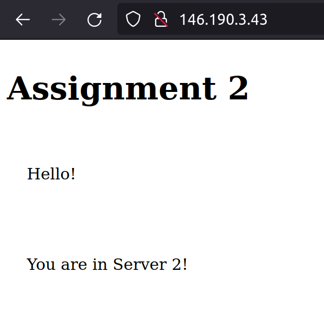
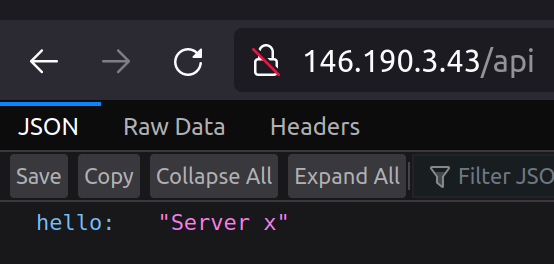

# 2420 Assignment 2

## Digital Ocean Setup

### VPC (Load Balancer)

Create a load balancer in Digital Ocean.  This will be used to distribute
traffic to the two web servers. Use the following settings:



### Firewall

Edit the firewall to allow traffic on port 80 (http).
Also configure the firewall to use the load balancer as the default. This can
be done by adding a new rule for http, disabling the traffic from all IPv4 and
IPv6. Add the load balancer that we created as the only source.



### Droplets

> Note: Adding tags to the web servers will make it easier to identify them
> and use them with the firewall rules and the load balancer.

Create two droplets.  These will be the web servers. Configure the droplets to
have two regular users. This can be done with the following steps (I will be
using kelsier as the username for both the servers. You can use any username):

1. `useradd -ms /bin/bash kelseir`* 
2. `usermod -aG sudo kelsier`
3. `passwd kelsier`
4. `rsync --archive --chown=kelsier:kelsier ~/.ssh /home/kelsier`
5. To prevent root login: `sudo vi /etc/ssh/sshd_config`
    1. make the following changes: `PermitRootLogin no`
6. `sudo systemctl restart ssh`

> Note: Step 5 is optional. It is **recommended** to disable root login.


---

## Server setup

### Installing web server

For this tutorial I will be using caddy, but you can use any web server you
like. 

Caddy doesn't come with the apt package manager, so we will have to add teh
repo in ubuntu, and then install caddy. These are the steps to install caddy
from their website:

1. `sudo apt install -y debian-keyring debian-archive-keyring apt-transport-https`
2. `curl -1sLf 'https://dl.cloudsmith.io/public/caddy/stable/gpg.key' | sudo gpg --dearmor -o /usr/share/keyrings/caddy-stable-archive-keyring.gpg`
3. `curl -1sLf 'https://dl.cloudsmith.io/public/caddy/stable/debian.deb.txt' | sudo tee /etc/apt/sources.list.d/caddy-stable.list`
4. `sudo apt update`
5. `sudo apt install caddy`

This will create a caddy.service file for you. It will also add a
configuration file for caddy in `/etc/caddy/Caddyfile`.

> Note: Here the IP address belongs to our load balancer.

```
# The Caddyfile is an easy way to configure your Caddy web server.
#
# Unless the file starts with a global options block, the first
# uncommented line is always the address of your site.
#
# To use your own domain name (with automatic HTTPS), first make
# sure your domain's A/AAAA DNS records are properly pointed to
# this machine's public IP, then replace ":80" below with your
# domain name.

http:// {
	# Set this path to your site's directory.
	root * /var/www/146.190.3.43/html

	# Enable the static file server.
	file_server

	# Another common task is to set up a reverse proxy:
	reverse_proxy /api localhost:5050

	# Or serve a PHP site through php-fpm:
	# php_fastcgi localhost:9000
}

# Refer to the Caddy docs for more information:
# https://caddyserver.com/docs/caddyfile
```

### Writing the web-app

> Note: All the files for the tutorial are kept in the `2420_assign2` folder.

`tree` output:

```
.
├── Caddyfile
├── hello_web.service
├── html
│   └── index.html
├── images
│   ├── api.png
│   ├── curl.png
│   ├── firewall.png
│   ├── load_balancer.png
│   ├── move_perms2.png
│   ├── server1.png
│   ├── server2.png
│   └── services.png
├── README.md
└── src
    ├── index.js
    └── package.json

3 directories, 14 files
```


For this tutorial I will use node and the fastify package. We will install
node with Volta. 

To install node with Volta: 

1. `curl https://get.volta.sh | bash`. This will install Volta.
2. `source ~/.bashrc` to reload the bashrc file as Volta will write to your
   .bashrc file to add the Volta path to your PATH variable.
3. `volta install node` to install node with volta.

`npm` will be installed with node. We will use npm to install fastify. But
before that, we can check that both node and npm are installed by running
`which node` and `which npm`. This should return the path to the node and npm.

```
uday ~ → which node
/home/uday/.volta/bin/node
uday ~ → which npm
/home/uday/.volta/bin/npm
```

To write the web-app, create two directories: `html` and `src`. In the `src`
directory we will start a new node project with `npm init` and then install
fastify with `npm install fastify`. Then we will create a file called `index.js`. 

```js
// Require the framework and instantiate it
const fastify = require('fastify')({ logger: true })

// Declare a route
fastify.get('/api', async (request, reply) => {
  return { hello: 'Server x' }
})

// Run the server!
const start = async () => {
  try {
    await fastify.listen({ port: 5050, host: '127.0.0.1' })
  } catch (err) {
    fastify.log.error(err)
    process.exit(1)
  }
}
start()
```

Since we want to listen on `localhost:5050`, we will change the port in the
index.js file to 5050. We will also add the host to `127.0.0.1` to specify
localhost.


In the `html` directory create a file called `index.html`.

```html
<!DOCTYPE html>
<html lang="en">
<head>
    <meta charset="UTF-8">
    <meta http-equiv="X-UA-Compatible" content="IE=edge">
    <meta name="viewport" content="width=device-width, initial-scale=1.0">
    <title>2420 Assignment 2</title>
</head>
<body style="display: flex; justify-content: center; align-content: center; flex-direction: column;">
    <h1>Assignment 2</h1>
    <p style="padding: 20px;">Hello!</p>
    <p style="padding: 20px"> You are in Server 1!</p> 
</body>
</html>
```

### Service file to start the web-app

To start the web-app we will create a service file. It will be called `hello_web.service`. 

> Note: Make sure to include the full path for the node binary and the volta command.

```service
[Unit]
Description=Web server for 2420 lab
After=network-online.target
Wants=network-online.target

[Service]
ExecStart=/home/kelsier/.volta/bin/node /var/www/146.190.3.43/src/index.js
ExecReload=/home/kelsier/.volta/bin/node /var/www/146.190.3.43/src/index.js
User=kelsier
Group=kelsier
Restart=on-failure
RestartSec=15
TimeoutSec=10

[Install]
WantedBy=multi-user.target
```

You will notice that we have the correct directories for our servers.

The `Restart=on-failure` directive will restart the service if it fails. 

The `After` and `Wants` directives will make sure that the service starts
after the network is online.

---

## Moving files to servers

We will use rsync to move the files to both the servers. Then we will move all
the files to the correct directories and give them the correct permissions. I
have removed the node_modules folder from the src directory since that is too
many files to send. I will `npm install` on the servers to recreate the node_modules folder.

``` 
rsync -aPv 2420_assign2 kelsier@143.198.228.171:~/
```

Then we will run `npm install` in the `src/` directory
to recreate the node_modules folder.

Move the files to the correct directories and give them the correct permissions.



Then we will do a `daemon-reload` and start and enable the services.

Check the status of both the `hello_web` and `caddy` services:



---

## Testing

We can check if our server is working or not by check the output of the
following commands:

`curl localhost` and `curl localhost:5050/api`



If you see your index.html file and the api output, then you are good to go!

You can visit [146.190.3.43](http://146.190.3.43) and
[http://146.190.3.43/api](http://146.190.3.43/api) to see the
web-app and the reverse-proxy working.

Server 1 and Server 2:

 



You can also see that the api is working:

