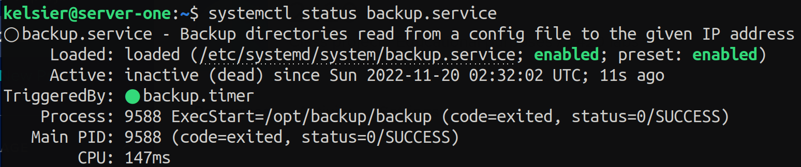
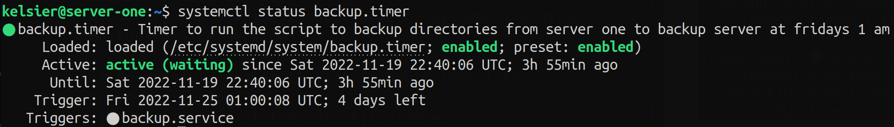
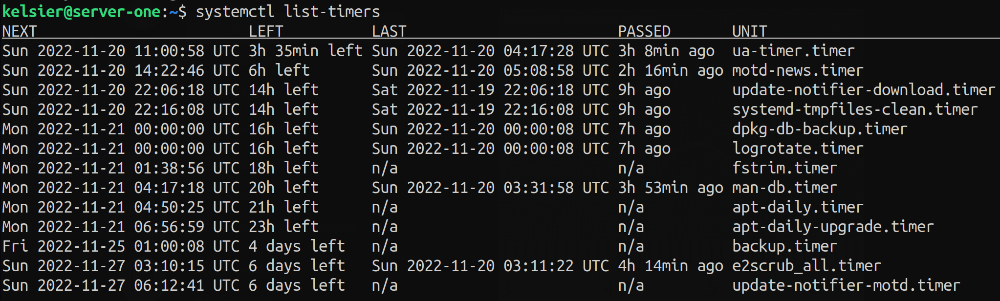

# ACIT 2420 WEEK 11 Lab
## Team Members

- Simon Freeman
- Uday Chhina

## Setup

To setup, create two droplets in Digital Ocean. `server-one` and `backup-server`. In the `server-one` droplet, create a new ssh key pair to be used with the `backup-server`. 

Copy the contents of the `.pub` file that was created in your `~/.ssh` directory and add them to the `authorized_keys` file in the `~/.ssh/` directory in the `backup-server` droplet. 

---

## Backup

Creates and updates backups of specified directories from server-one into the backup-server every Friday at 01:00.

1. Create a directory in `/opt` by using `sudo mkdir /opt/backup`

### Create the script

1. Make the backup script that will use `rsync` to backup directories from `server-one` to `backup-server`. 
2. Move this file into `/opt/backup` and ensure it has execute permissions (`chmod +x backup`).
    
```bash
#!/bin/bash
. /opt/backup/backup_config
rsync -aP "${DIRS[@]}" "dalinar@${IP}:~/" -e "ssh -i /home/kelsier/.ssh/backup_key -o StrictHostKeyChecking=no"
```
---
### Create the config file
The config file will be placed in the `/opt/backup/` directory as well. It will have two variables:

- `DIRS`: An array of directories to back up. **Must use absolute paths.**
- `IP`: The IP address of backup-server.  

```
DIRS=("/home/kelsier/test1" "/home/kelsier/test2" "/home/kelsier/test3")
IP=146.190.41.39
```
---
### Create the unit files 
`backup.service`

The file should look something like this:

```
[Unit]
Description=Backup directories read from a config file to the given IP address

[Service]
Type=oneshot
ExecStart=/opt/backup/backup

[Install]
WantedBy=multi-user.target
```
To activate: 
1. Place the file in `/etc/systemd/system/`    
2. To enable the service, use `systemctl enable backup-service.service` 
3. To start  the service, use `systemctl start backup-service.service`
4. Verify the service is active with `systemctl status backup-service.service`

If successful, systemctl status should look like screenshot below:


`backup.timer`

This file should look something like this:

```
[Unit]
Description=Timer to run the script to backup directories from server one to backup server at fridays 1 am

[Timer]
Unit=backup.service
OnCalendar=Fri *-*-* 01:00:00
Persistent=true
RandomizedDelaySec=10

[Install]
WantedBy=timers.target
```
The timer section of the unit file contains 2 important options:

- `Persistent` - to make sure that if the machine was offline when the timer would have triggered the service file, the timer gets activated when the machine comes back online. 
- `RandomizedDelaySec` - to make sure that if we have mutliple service files for back up that are supposed to go off at the same time, they don't start backing up at exactly the same time. 

To activate
1. Place the file in `/etc/systemd/system/`    
2. To enable the service, use `systemctl enable backup-timer.timer` 
3. To start  the service, use `systemctl start backup-timer.timer`
4. Verify the service is active with `systemctl status backup-timer.timer`
   - You can also check if the timer has started by checking if it is present in the output of `systemctl list-timers`


If successful, systemctl status should look like screenshot below:

Alternatively, the output of `systemctl list-timers` should contain `backup.timer`:


---
## Weather

Retrieves the weather forecast in Vancouver every day at 05:00

Follow the steps above to make unit files and the script for the message of the day weather info. There should be three files: 

`weather`: the script that gets the weather info for Vancouver from wttr.in

`weather.service`: the service unit file that starts the `weather` script

`weather.timer`: the timer that triggers the service everyday at 5 am.

If the setup was successful, you will see the following message when you log back in to the server:

